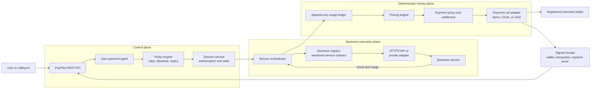

# PayPilot — autonomous capped payment agent

PayPilot is a runnable reference implementation of an AI payment agent that can buy metered services from multiple businesses without giving a merchant arbitrary access to the user's wallet.

The user authorizes a visible maximum once. Deterministic code meters actual usage, blocks work that would cross the cap, and settles only the consumed amount. The result is released with a signed, itemized receipt after settlement.

The repository ships with a **signed local payment simulator**. It never moves real funds. A production x402/Circle rail must be added behind the payment adapter before deployment.

## Project deliverables

- [Investor and technical architecture presentation](deliverables/PayPilot_Investor_Technical_Deck_Business_Integration.pptx) — dark-theme product, business-integration, Circle, Razorpay, safety, and rollout overview.
- [Automated test-case register with evidence](deliverables/PayPilot_Automated_Test_Case_Register_With_Evidence.xlsx) — test scenarios, expected results, execution status, and recorded evidence.
- [Full PayPilot demo video](demo/paypilot_demo.mp4) — long-form product demonstration recording.

On GitHub, select any file to preview its metadata or download the original artifact.

## Demo video

[](demo/paypilot_demo.mp4)

[Watch or download `paypilot_demo.mp4`](demo/paypilot_demo.mp4)

The recording is intended to demonstrate the application running locally at [http://127.0.0.1:4021](http://127.0.0.1:4021). The default local payment rail is a signed simulator and does not move real funds. A real Circle wallet transaction and block-explorer URL require the production payment adapter.

## Run it

Requirements: Node.js 22 or newer. There are no runtime package dependencies.

```bash
npm test
npm start
```

Open [http://127.0.0.1:4021](http://127.0.0.1:4021).

The dashboard demonstrates one payment agent across three independent merchant identities:

- Veritas Research — supplier intelligence
- DocWise AI — document risk analysis
- Campaign Forge — creative campaign concepts

## What is implemented

- Explicit session state machine from offer through delivery
- Server-bound merchant wallets, service, pricing version, network, token, payer, expiration, and nonce
- User payment-agent policy checks: allowlists, category, token, network, per-session limit, daily limit, balance, expiry, recurrence, and manual-approval threshold
- Exact six-decimal USDC atomic arithmetic using `BigInt`
- Append-only, idempotent usage ledger separate from service input/output
- Versioned deterministic pricing; model/service plugins never calculate money
- Budget-aware orchestration with partial delivery at a low cap
- Single-use authorization nonce and settlement idempotency
- Signed itemized receipts and amount-not-charged disclosure
- Persistent atomic JSON store suitable for local development
- Server-sent live session events and a customer dashboard
- Emergency-stop configuration and production-mode safety check

## Core flow

```text
Create session → signed capped offer → user agent policy evaluation
       → scoped authorization → autonomous metered execution
       → deterministic charge validation → idempotent settlement
       → result + signed receipt
```

The service model can plan which operations are useful. Only the pricing and payment-policy engines can approve a billable event or final settlement.

## Architecture



The business receives a scoped task contract and returns structured output, metered usage, and delivery evidence. It never receives the user's wallet keys or authority to change the price, recipient, network, cap, or final settlement.

## REST API

| Method | Endpoint | Purpose |
|---|---|---|
| `GET` | `/v1/businesses` | Discover registered merchants and services |
| `GET` | `/v1/services` | Discover service and pricing-version metadata |
| `POST` | `/v1/sessions` | Create a capped service session and signed offer |
| `GET` | `/v1/sessions/{id}` | Read state, live charge, remaining cap, result, and receipt |
| `POST` | `/v1/sessions/{id}/authorize` | Submit an external authorization or invoke the demo user agent |
| `POST` | `/v1/sessions/{id}/start` | Start autonomous execution (`{"wait":true}` waits for completion) |
| `GET` | `/v1/sessions/{id}/events` | Read the immutable usage ledger |
| `GET` | `/v1/sessions/{id}/stream` | Subscribe to server-sent live events |
| `GET` | `/v1/sessions/{id}/receipt` | Read the receipt after settlement |
| `POST` | `/v1/sessions/{id}/cancel` | Cancel an eligible session |

Example session request:

```json
{
  "userId": "usr_456",
  "payerAddress": "0xaaaaaaaaaaaaaaaaaaaaaaaaaaaaaaaaaaaaaaaa",
  "service": "supplier-research",
  "maximumChargeUsdc": "1.00",
  "input": {
    "industry": "food packaging",
    "location": "Bengaluru",
    "priority": "balanced"
  }
}
```

## Add another business

A trusted bootstrap module can call `registerBusinessPlugin()` with:

1. A fixed merchant identity and receiving wallet.
2. One or more service definitions.
3. An immutable pricing-version identifier and rational atomic rates.
4. Input validation, planning, and execution functions.

Execution functions receive only `step()` and `meter()` capabilities. They do not receive wallet keys, settlement functions, arbitrary recipient addresses, or a way to mutate prior usage.

See [Architecture](docs/ARCHITECTURE.md) for the component boundaries and [Production guide](docs/PRODUCTION.md) for a real payment-rail checklist.

Deployment and integrations:

- [Google Cloud production deployment](docs/PRODUCTION-DEPLOYMENT.md)
- Connect any business through the [versioned plugin and trust-boundary contract](docs/ARCHITECTURE.md), using either a signed HTTPS endpoint or a private service adapter.
- [Use the shared payment agent with an existing Razorpay application](docs/RAZORPAY-INTEGRATION.md)

## Important limitations

This is an MVP/reference architecture, not a finished custody or financial product. It has no user authentication, KYC/AML controls, tax engine, database-grade multi-process locking, real facilitator, wallet UI, dispute workflow, or production observability. Those are deliberate deployment gates, documented in the production guide.
